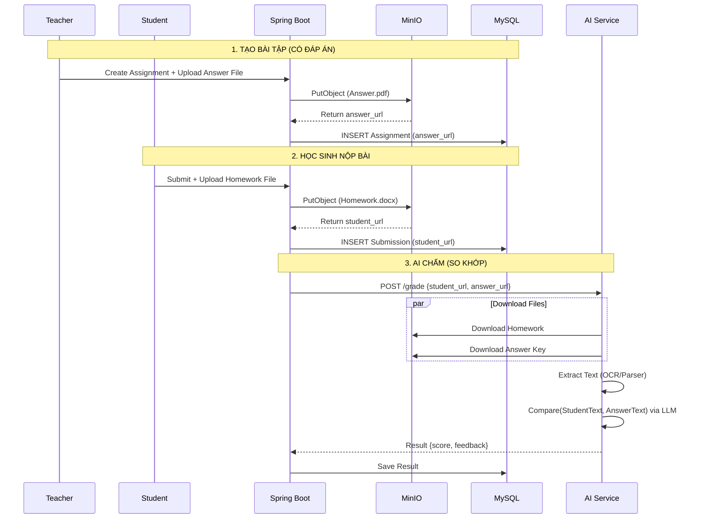

# 📘 PROJECT SPECIFICATION: SMART LMS (AI-POWERED)

**Project Name:** Smart Learning Management System
**Version:** 3.0 (MinIO + Answer Key Integration)
**Last Updated:** 2025-12-14
**Status:** Development Ready

---

## 1. 🌟 Tổng Quan Dự Án (Project Overview)

Xây dựng hệ thống LMS quản lý dạy và học với tính năng cốt lõi là **AI Auto-Grading (Chấm điểm tự động)**.
Điểm khác biệt của hệ thống:

- **Storage:** Sử dụng **MinIO (S3 Compatible)** để lưu trữ bảo mật toàn bộ file bài tập và bài làm.
- **Smart Grading:** AI không chấm "mò" mà chấm dựa trên **File Đáp án/Ba-rem** do giáo viên cung cấp, đảm bảo độ chính xác và khách quan.

---

## 2. 🏗️ Tech Stack & Hạ Tầng

| Hạng mục       | Công nghệ            | Chi tiết kỹ thuật                                                             |
| :------------- | :------------------- | :---------------------------------------------------------------------------- |
| **Frontend**   | **Next.js 14+**      | App Router, TypeScript, TailwindCSS (Shadcn/UI).                              |
| **Backend**    | **Spring Boot 3.x**  | Java 21, Spring Security (JWT), Spring Data JPA.                              |
| **Database**   | **MySQL 8.0**        | Lưu Metadata (User info, điểm số, đường dẫn file).                            |
| **Storage**    | **MinIO**            | Lưu trữ vật lý file (PDF, Word, Ảnh). Self-hosted S3.                         |
| **AI Service** | **Python (FastAPI)** | Xử lý OCR (EasyOCR/Tesseract), đọc PDF/Word và Logic chấm điểm so khớp (LLM). |
| **Deployment** | **Docker Compose**   | Đóng gói toàn bộ 4 services để chạy Local/Production dễ dàng.                 |

---

## 3. 🏛️ Kiến Trúc Hệ Thống (Architecture)

### 3.1. Luồng dữ liệu File (File Data Flow)

Hệ thống xử lý 2 luồng file song song:

1.  **Teacher Flow:** Upload `Answer Key` (Đáp án) $\rightarrow$ MinIO $\rightarrow$ DB lưu URL.
2.  **Student Flow:** Upload `Submission` (Bài làm) $\rightarrow$ MinIO $\rightarrow$ DB lưu URL.

**Nguyên tắc chấm:** AI Service sẽ tải **cả 2 file** về, trích xuất văn bản và so sánh mức độ tương đồng/chính xác để ra điểm.

### 3.2. Sơ đồ tuần tự (Sequence Diagram) - Quy trình Chấm điểm



---

## 4\. 🗄 Database Schema Update

Cập nhật bảng `assignment` để chứa link đáp án.

```sql
-- 1. Bảng Bài tập (Assignment)
CREATE TABLE assignment (
    id BINARY(16) NOT NULL PRIMARY KEY,
    title VARCHAR(255),
    description TEXT,

    -- URL file đáp án trên MinIO (NEW)
    answer_file_url VARCHAR(500) NULL,

    deadline DATETIME,
    class_id BINARY(16),
    created_at DATETIME DEFAULT NOW()
);

-- 2. Bảng Kết quả AI (AI Grading Result)
CREATE TABLE ai_grading_result (
    id BINARY(16) NOT NULL PRIMARY KEY,
    submission_id BINARY(16) NOT NULL,

    ai_score DECIMAL(4, 2), -- Điểm do AI chấm (0-10)
    ai_feedback TEXT,       -- Nhận xét chi tiết

    match_percentage INT,   -- Độ khớp với đáp án (%)
    created_at DATETIME DEFAULT NOW(),

    FOREIGN KEY (submission_id) REFERENCES assignment_submission(id)
);
```

---

## 5\. 📂 Cấu trúc Dự án (Project Structure)

```text
my-lms-project/
├── docker-compose.yml           # Setup MySQL, MinIO, AI Service
├── .env                         # Environment Variables
│
├── backend/ (Spring Boot)
│   ├── src/main/java/com/lms/
│   │   ├── config/MinioConfig.java
│   │   ├── service/
│   │   │   ├── MinioStorageService.java  # Upload/GetUrl
│   │   │   ├── AiGradingService.java     # Logic gửi 2 URL sang Python
│   │   │   └── AssignmentService.java    # Logic tạo bài tập + Up đáp án
│   │   └── controller/SubmissionController.java
│
├── frontend/ (Next.js)
│   ├── src/app/teacher/assignments/create/page.tsx # Form có 2 nút upload (Đề & Đáp án)
│   ├── src/components/FileUploader.tsx
│
└── ai-service/ (Python FastAPI)
    ├── main.py                  # API nhận {student_url, answer_url}
    ├── file_processor.py        # Logic OCR/PDF Parser (EasyOCR)
    └── grader_logic.py          # Logic tạo Prompt so sánh
```

---

## 6\. 🧠 AI Logic Specification (Python Service)

Logic xử lý tại `ai-service` khi nhận request.

**Input:**

- `student_url`: Link bài làm học sinh.
- `answer_url`: Link đáp án giáo viên.

**Process:**

1.  **Fetch:** Tải 2 file từ MinIO về bộ nhớ đệm.
2.  **Extract:**
    - Nếu là Ảnh: Dùng `EasyOCR` convert sang Text.
    - Nếu là PDF/Word: Dùng `pdfplumber`/`python-docx` extract Text.
3.  **Compare (Prompt Engineering):**
    - Gửi Prompt sau cho LLM (OpenAI/Gemini/LocalLLM):
      > "Bạn là giáo viên. Hãy so sánh [BÀI LÀM HỌC SINH] với [ĐÁP ÁN MẪU].
      > Hãy chấm điểm dựa trên độ chính xác của ý tưởng, từ khóa quan trọng.
      > Bỏ qua lỗi chính tả nhỏ nếu không ảnh hưởng ý nghĩa.
      > Trả về JSON: {score, feedback, reason}."

---

## 7\. 🛠 Hướng dẫn Setup Docker (Local Environment)

File `docker-compose.yml` chuẩn để chạy MinIO và các dịch vụ.

```yaml
version: "3.8"
services:
  # --- 1. Database ---
  mysql:
    image: mysql:8.0
    environment:
      MYSQL_ROOT_PASSWORD: root
      MYSQL_DATABASE: lms_db
    ports: ["3306:3306"]

  # --- 2. Storage (MinIO) ---
  minio:
    image: minio/minio
    container_name: lms_minio
    ports:
      - "9000:9000" # API Port
      - "9001:9001" # Console Port (Web UI)
    environment:
      MINIO_ROOT_USER: minioadmin
      MINIO_ROOT_PASSWORD: minioadmin
    command: server /data --console-address ":9001"
    volumes:
      - ./minio_data:/data

  # --- 3. AI Service ---
  ai-service:
    build: ./ai-service
    ports: ["8000:8000"]
    depends_on:
      - minio
```

---

## 8\. 📝 Use Cases Chi tiết

### UC-01: Giáo viên Tạo Bài tập (Teacher)

1.  Nhập Tiêu đề, Mô tả, Hạn nộp.
2.  **Quan trọng:** Upload file `Dap_an_cau_1.pdf`.
3.  Hệ thống upload file lên MinIO bucket `teacher-answers`.
4.  Lưu bài tập kèm link đáp án vào DB.

### UC-02: Học sinh Nộp bài (Student)

1.  Học sinh làm bài ra giấy, chụp ảnh hoặc làm file Word.
2.  Upload file lên hệ thống.
3.  Hệ thống upload lên MinIO bucket `student-submissions`.

### UC-03: Chấm điểm (System)

1.  Ngay sau khi nộp, Backend kích hoạt Async Job.
2.  Job lấy `answer_url` (từ bài tập) và `student_url` (vừa nộp).
3.  Gửi cả 2 sang AI Service.
4.  AI đọc hiểu cả 2, so sánh và trả về điểm số.
5.  Giáo viên vào xem lại (Review), có thể sửa điểm AI nếu thấy chưa thỏa đáng.

---
